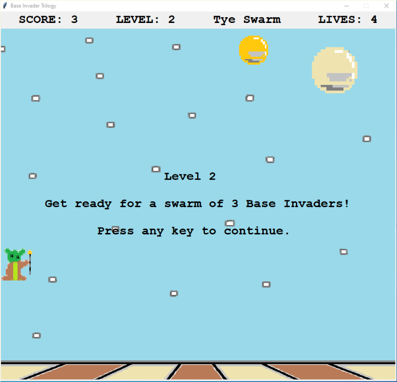

# my-little-video-game
A vintage style video game class that is very basic and written in python.  This is my first try at using object oriented programming.  I intend to upload
some more source code as examples.  In the meantime, if you install to Windows with the msi installer you can look in the program folder to see the source code.

A main point of using these classes is to make a 2d video game, reminiscient of Atari 2600 or Commodore 64 very quickly.

### I intend to combine all of my sound and image manipulation python libraries into this project with an example video game.  For now you can check out their source code separately at these projects `PreferredSoundPlayer` and `tkPhotoImageFunctions`.

### I wrote the soundplayers and imagefunctions because pygame and playsound modules were not truely cross-platform and did not work correctly when going from Windows to Linux.  These sound players and image manipulation functions may not be as robust.  However, at least they work.

The classes will use basic common libraries like tkinter, playsound, pygame for sound.

contact info: garydavenport73@gmail.com
